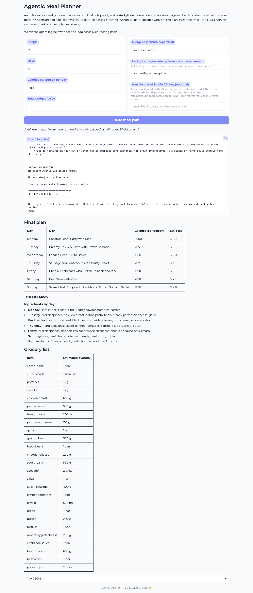

# Agentic Meal Planner

Ever have left over groceries in your refrigerator that you don't want to go to
waste? In this agentic workflow, we'll generate a meal plan that makes use of
all your existing groceries, generating a daily series of meals at specified
caloric levels and under a certain budget.

It writes a plan, reviews its own work, and fixes what it got wrong — built
with the OpenAI Python SDK and no agent framework. The orchestration is plain
Python.

Given a household's constraints, it produces a validated meal plan and a
combined grocery list:

```python
user_inputs = {
    "people": 2,
    "days": 7,
    "daily_calories": 2000,
    "allergens": ["peanuts", "shellfish"],
    "budget_usd": 110,
    "pantry": ["rice", "lentils", "frozen spinach"],
}
```



## The loop

```text
User Inputs
    ↓
draft_plan()                     LLM writes an initial plan
    ↓
┌──────────────────────────────────────────────┐
│  critique_plan()   LLM, subjective reviewer  │
│  validate_plan()   Python, objective judge   │
│         ↓                                    │
│  any mandatory fixes?                        │
│    yes → revise_plan() → repeat, ≤3 passes   │
└──────────────────────────────────────────────┘
    ↓ no
Final Meal Plan
    ↓
build_grocery_list()
```

## How it demonstrates each concept

**Prompt chaining.** Five distinct prompts, each consuming the previous step's
output rather than restating the task: `draft_plan` → `critique_plan` →
`revise_plan` → (loop) → `build_grocery_list`. The plan is passed between them
as JSON via `json.dumps(plan, indent=2)`, so every stage reads structured data
instead of prose it would have to re-parse.

**JSON mode / structured output.** Every call sets
`response_format={"type": "json_object"}`, and each prompt embeds the exact
schema it must return. This is what makes chaining possible at all — the output
of one step is a dict the next step can index, not text to scrape.

**Evaluator–optimizer pattern.** `critique_plan()` is a separate LLM call with
an adversarial system role ("a strict dietary quality-assurance inspector") that
never writes plans, only judges them. `revise_plan()` is the optimizer that
consumes those judgements. Splitting generation from evaluation across two calls
means the critic isn't defending work it just produced.

**Deterministic validation.** `validate_plan()` is ordinary Python with no LLM
involved. It re-checks all five constraints — day count, budget, ±15% calories,
allergens, exact pantry names — and returns a list of strings. This exists
because an LLM asked to grade itself will happily declare a broken plan
correct. The Python validator cannot be persuaded.

**Separating subjective judgement from objective rules.** The two reviewers do
different jobs. The Python validator owns anything countable and is the sole
authority on whether the plan is correct. The LLM critic owns what code can't
judge — variety, prep effort, seasonality, nutritional balance — and its output
is split into `fixes` (mandatory) and `suggestions` (optional). Suggestions are
passed to the reviser but are explicitly allowed to be ignored when they'd
break a hard constraint.

**Agentic orchestration.** `build_plan()` is the controller: it decides which
step runs next, merges the two reviewers' findings into one `combined_fixes`
list, decides when the work is done, and enforces a `MAX_PASSES` budget so a
model that can't satisfy the constraints fails loudly instead of looping
forever. That control flow is a `for` loop and an `if` — deliberately, since
the whole point is that the agency lives in the Python, not in a framework.

**Iterative self-correction.** Each pass feeds concrete, machine-generated
violations back into the next prompt. The exact-name pantry rule reliably
triggers this: a model asked for "rice" tends to write "basmati rice", the
validator catches it, and the next pass fixes it. After the loop, a final
`validate_plan()` runs and prints a warning if anything survived — the program
never claims success it hasn't verified.

## Running locally

Requires Python 3.9+.

```bash
pip install -r requirements.txt
cp .env.example .env        # then add your GOOGLE_API_KEY
python3 meal_planner.py     # command-line run
python3 app.py              # web UI
```

A full run makes three to eight sequential model calls.

## Tests

```bash
python3 tests/test_validator.py         # no API key needed, no quota used
python3 tests/test_correction_loop.py   # forces the revision path to run
python3 tests/test_fallback.py          # model fallback + notice isolation
python3 tests/check_models.py           # which models work, and their quotas
python3 tests/capture_screenshot.py     # drives the UI, writes screenshots/app.png
```

`test_validator.py` is the one that matters most and the only one that is
free to run: it checks that the deterministic validator catches wrong day
counts, budget overruns, out-of-range calories, inexact pantry names
(`fresh spinach` for `frozen spinach`), and allergens hidden in compound
ingredients (`peanut oil` against an allergen listed as `peanuts`) — while
still not tripping over `eggplant` for an `egg` allergy.

`test_correction_loop.py` exists because the model almost always produces a
valid plan on the first attempt, so `revise_plan()` would otherwise never run
during testing. It seeds a deliberately broken draft to force the loop.

## On the model provider

The exercise this was built for specifies the OpenAI SDK and `gpt-4o`. Since a
public demo would mean paying for every visitor's run, this uses Google's
**OpenAI-compatible endpoint** instead, which keeps the SDK code identical:

```python
client = OpenAI(
    api_key=os.environ["GOOGLE_API_KEY"],
    base_url="https://generativelanguage.googleapis.com/v1beta/openai/",
)
```

`client.chat.completions.create(...)` and `response_format={"type":
"json_object"}` are unchanged — only `base_url`, the key, and the model name
differ. The paid OpenAI configuration is left in `meal_planner.py` as
commented-out reference; nothing reachable at runtime can select a billable
model, and there is no model picker in the UI.

### Which model, and why

Picked by measuring the endpoint rather than trusting the docs:

| Model | Result |
| --- | --- |
| `gemini-3.7-flash` | Google's own example model. Returned 503, then 429, on every attempt — it does not appear to be served on the free tier. **Excluded.** |
| `gemini-3.6-flash` | Best output by a wide margin: varied dishes, plausible per-day calories and costs. Capped at **20 requests/day**. |
| `gemini-3.5-flash-lite` | Larger daily quota, weaker planning — left alone it served lentils, rice and spinach all seven nights. |

One run costs three to eight requests, so 20/day is roughly two runs before a
shared Space goes dark. `meal_planner.py` therefore configures a **fallback
chain**: each call tries `gemini-3.6-flash` first and drops to
`gemini-3.5-flash-lite` on a 429 or 503. Quota is metered per model, so the
second one still has its own budget. The downgrade is announced in the agent
log rather than applied silently, since the output really is weaker afterwards.

All three were verified to accept `response_format={"type": "json_object"}` on
the compatibility endpoint, which Google's documentation does not actually
promise — it demonstrates Pydantic parsing instead.

### A note on `suggestions`

`build_plan()` stops as soon as `fixes` is empty, exactly as specified. A
side effect worth knowing: when the first draft is already valid — the common
case — the critic's `suggestions` are computed and then discarded, because
nothing triggers a revision. In one run the critic correctly observed that
"rice is featured in four out of seven meals" and the loop ignored it. That is
the specified behaviour, not a bug: variety is not a hard constraint, and the
deterministic validator is the only thing allowed to force a rewrite.

## Deploying

The API key must be set as a **Repository Secret** named `GOOGLE_API_KEY` in
the Space's Settings → Variables and secrets. It is read server-side only and
is never exposed to visitors. Visitors may optionally paste their own free key,
which is used for that request alone and never stored.
